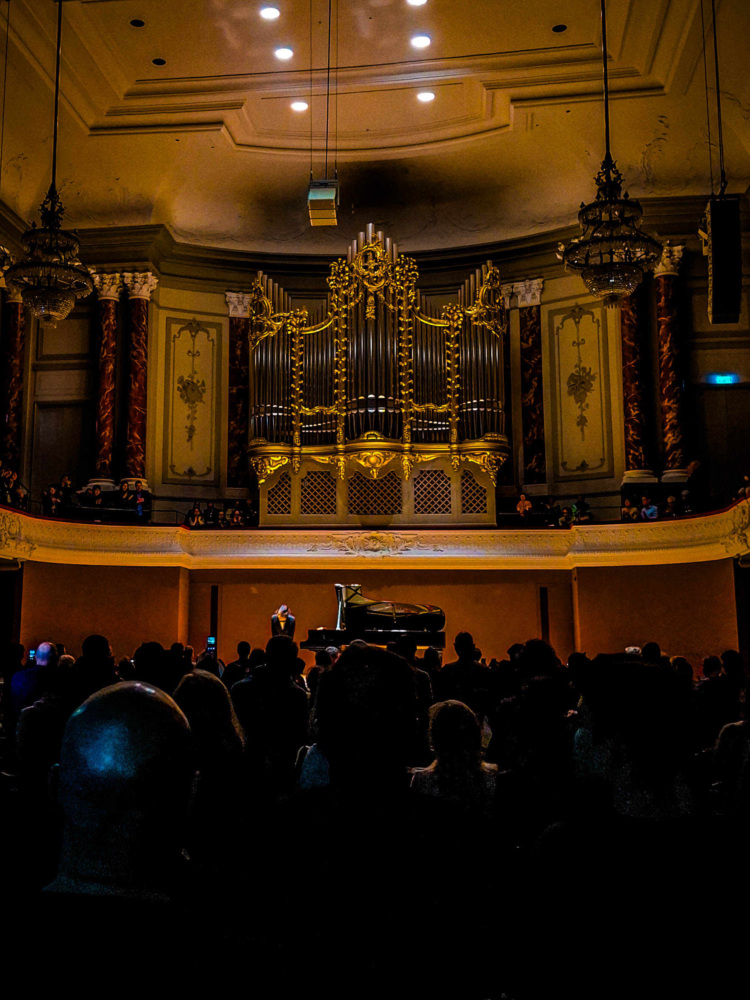
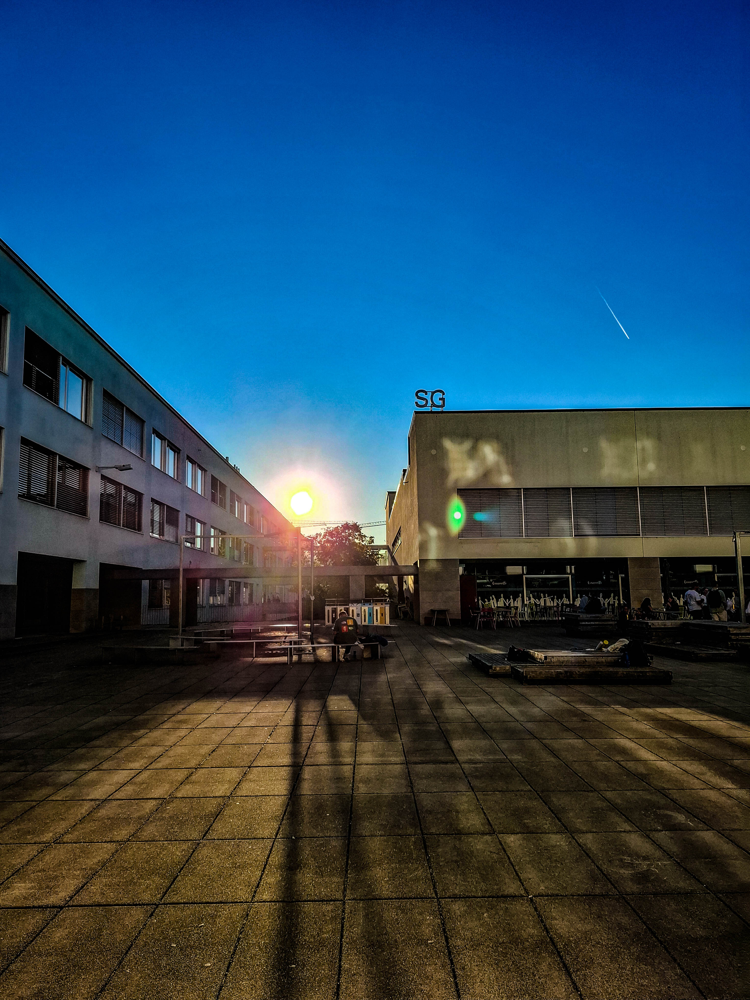

## 11.01.2026 Cateen’s Tanzfestival in Basel

---

### Program
1. Johann Sebastian Bach: "Italian Concerto" F Major BWV 971 (Leipzig, 1735)  

<ol type="I">
  <li>Without tempo indication [Allegro]</li>
  <li>Andante</li>
  <li>Presto</li>
</ol>

2. Alberto Ginastera: Sonata No. 1 Op. 22 (Buenos Aires, 1952)  

<ol type="I">
  <li>Allegro marcato</li>
  <li>Presto misterioso</li>
  <li>Adagio molto appassionato</li>
  <li>Ruvido ed ostinato</li>
</ol>

3. Igor Stravinsky: "The Firebird" (St. Petersburg, 1909/10)  
Excerpts from the ballet, arr. Guido Agosti 

<ol type="I">
  <li>Danse infernale du Roi Kastcheï</li>
  <li>Berceuse</li>
  <li>Finale</li>
</ol>

 

(Intermission) 

 

4. Hayato Sumino: Big Cat Waltz Op. 11  
5. Camille Saint-Saëns: "Danse macabre" Op. 40 (arr. H. Sumino) (Paris, 1874)
6. Maurice Ravel:

<ul>
  <li>"La Valse" (Paris, 1919/20)</li>
  <li>"Pavane pour une Infante défunte" (Paris, 1899)</li>
</ul>

7. George Gershwin: "Rhapsody in Blue" (New York, 1924)

---

「Cateen 貓叼著直播攝影機，在地球的時間線上穿梭，時而漫步，時而躍動。」  
 
這是我第一次到 Stadtcasino Basel 聽音樂會，座位是 2F seat 22，中間偏後。儘管上面有部分天花板遮蔽，但殘響消散的速度仍舊俐落到讓我耳目一新。  
 
總之，這場以「舞步」為主軸的 live 就從金碧輝煌的巴洛克庭園中開展。Bach 的 Italian Concerto Mvt. I 像是莊園內平和永恆的草地，近午，陽光輕拂。Mvt. II 切換到夜晚，遠方城堡傳來歌女的詠唱，葉脈悄然舒展。Mvt. III 重新回歸早晨，在左手低音聲部極為平衡的襯托下，我彷彿看見，一隻興奮的兔子躍動出疏影變幻的陽光。  
 
Sonata No. 1 的作曲者 Alberto Ginastera 我之前沒聽過，一查之下才發現是 Tango 大師 Astor Piazzolla 的老師，剛好他們都是 Argentinian。Mvt. I 鮮明的反拍像是 mojito 中翻騰的冰塊。到了 Mvt. II 詭譎的死亡觀想已然開幕。在星雲盤面（恆星的亂葬崗）的旋轉之中，我聽見的 Prokofiev 般鋼鐵的荒謬。在 Mvt. III 不和諧的血紅和弦幕布揭開之時，上學的孩童謹慎地踏著石子渡過湍流，在日復一日的練習中增加腳底的抓地力。練習行走於荒蕪的高原。Mvt. IV 在血橙 whiskey 的狂喜中結束，b-side 的影子是原始深藍的 tocatta。  
 
今天火鳥的鋼琴改編， Cateen 選了三幕來演出。在寧靜的清晨，鳥翼輕輕搧動平靜的海面。緊接著，高聳森嚴的城堡無預警出現。航程進入風暴區，耳旁不時傳來公主斷續的呼救。魔王輕緩地踏步昭示自信，在大殿內產生莊嚴的迴響。在最後一幕中，場景切換到最後伊凡與莎莉芙娜這對戀人重新相遇，在宛如 Disney 片頭煙火中的歡樂氣氛中，火鳥飛向天空結束上半場。  
 
中場休息後，Cateen 帶來自己寫給心愛貓咪的 Waltz。在 Vienna 的豪華舞廳中，厚實且敏捷的貓掌在地面上躍步。我似乎能看見 Rachmaninoff Op. 23 No. 6 和鋼琴版 Cello Sonata Op. 19 Mvt. 3 (Andante) 中的流光溢彩。  
 
下一幕， Cateen 改編的骷髏之舞登場於 jeux de l'eau 的光影之中。雖然前半首曲子我自己可能會想再加 boost 高聲部的 equalizer，不過我挺喜歡結尾在星雲墓地中傳來的誠摯的哀悼，以及祈禱。  
 
第八日，La Valse 彷彿教堂神聖的追思。極晨的涼意凝結在霧中，東方升起朝陽。在世界的反面，（反覆練習微笑失敗的）小丑終於鼓起勇氣走進了 Vienna 舞池。Pavane 準確地傳達出了眾人皆舞我獨醒的抽離感。小丑在睹舞思人的感慨之中，彷彿成為結局已定的繁花，在鏡面，吊燈以及酒杯之間尋找意義。時而陶醉，時而荒蕪地醒覺。  
 
最後，直播貓 Cateen 帶領我們來到演出結束後的地下酒吧，並招待了一杯 Blue Curaçao Glacier。觀眾內心的篤定槽 (san 值) 已經逐漸回滿。樂團即興演出中有 trumpet 花俏的滑舌，有 saxphone 性感的引誘。結合手風琴的演出更是神來之筆。我彷彿置身於 New Orleans, 1959。萬家燈火上，live camera 逐漸拉遠。一位旅人愜意地靠在落地窗旁的沙發上，啜飲著柚醬紅茶，望向這凜冬的璀璨雪城。  

 

---

 

“Cateen the cat carries a livestream camera in its mouth, wandering along the timeline of the Earth—sometimes strolling, sometimes leaping.”  
 
This was my first time attending a concert at Stadtcasino Basel. My seat was on the second floor, Seat 22, slightly toward the back of the center. Part of the ceiling hung low above, but the hall’s reverberation dissipated with surprising clarity—crisp and refreshing to the ear.  
 
The evening’s program revolved around the idea of dance, and it opened in a garden of Baroque splendor.  
 
The first movement of Bach’s Italian Concerto felt like the serene lawns of an aristocratic estate near midday, sunlight brushing gently across the grass. The second movement shifted into night: from a distant castle came the song of a court singer, while the veins of leaves quietly unfolded in the dark. The third movement returned to morning again. Supported by the perfectly balanced bass in the left hand, I seemed to glimpse an excited rabbit leaping through the dappled patterns of sunlight.  
 
I had never heard the composer Alberto Ginastera before. A quick search revealed that he had been the teacher of tango master Astor Piazzolla—both of them Argentinians. The first movement of Ginastera’s Sonata No. 1 pulsed with sharp offbeats, like ice cubes tumbling inside a mojito. By the second movement, a strange meditation on death had already begun. Amid the spinning disk of a nebula, namely, a graveyard of stars, I heard something like the iron absurdity of Prokofiev. When the blood-red curtain of dissonant chords opened in the third movement, I imagined schoolchildren carefully stepping across stones to cross a rushing stream, gaining traction underfoot through daily practice. Learning to walk across barren highlands. The fourth movement ended in a kind of ecstatic frenzy (like blood-orange whiskey) its shadowy B-side echoing a primordial, deep-blue toccata.  
 
For The Firebird, Cateen chose three scenes in piano transcription. In the quiet of dawn, wings brushed lightly across the surface of a calm sea. Then suddenly a towering, forbidding castle appeared. The voyage entered a storm zone, and one could hear a princess’s fragmented cries for help. The demon king strode slowly, radiating confidence, his steps echoing solemnly through the grand hall. In the final scene the stage shifted again: Ivan and Tsarevna were reunited, and amid an atmosphere of joy. Just like the fireworks of a Disney opening sequence, the Firebird soared upward, closing the first half.  
 
After the intermission, Cateen performed a waltz he had written for his beloved cat. In an opulent Viennese ballroom, sturdy yet nimble feline paws danced across the floor. I was reminiscient of Rachmaninoff, especially Prelude Op. 23 No. 6 and the third movement of the Cello Sonata Op. 19, shimmering within the texture.  
 
Next came Cateen’s arrangement of Danse Macabre, appearing within the watery light of Jeux d’eau. Personally I might have boosted the equalizer slightly in the upper register for the first half, but I loved the ending: a sincere lament and prayer rising from a nebular cemetery of stars.  
 
On the eighth day, La Valse unfolded like a sacred memorial inside a cathedral. The chill of early dawn condensed into mist as the sun rose in the east. On the other side of the world—a clown who has repeatedly failed to rehearse a convincing smile finally gathered the courage to step onto the Viennese dance floor. Pavane conveyed perfectly that sense of distance: everyone else dancing while one remains awake and apart. Watching the dancers, remembering someone absent, the clown seemed like a flower already destined to fade, searching for meaning among mirrors, chandeliers, and wine glasses. At times intoxicated, at times suddenly aware of the surrounding emptiness.  
 
At the end of the evening, Cateen the livestream cat led us into an underground bar after the performance and offered a glass of Blue Curaçao Glacier. The audience’s inner reservoir of calm—our “sanity meter,” or gradually refilled one might say. The band began to improvise: a trumpet sliding playfully through its phrases, a saxophone seducing the air with smoky lines. The addition of an accordion was a stroke of genius.  
 
For a moment I felt as though I had been transported to New Orleans, 1959.  
 
Above the lights of countless homes, the live camera slowly pulled back. A traveler leaned comfortably on a sofa by the floor-to-ceiling window, sipping yuzu black tea, gazing out at the dazzling winter snow city beyond.

 

---

 

  <figure style="flex: 1; margin: 0; text-align: center;">
    
    <figcaption style="margin-top: 0.5rem;">Standing ovation.</figcaption>
  </figure>
  <figure style="flex: 1; margin: 0; text-align: center;">
    
    <figcaption style="margin-top: 0.5rem;">陽光照耀在地球的經緯線上。 The sunlight shines across the Earth’s lines of latitude and longitude.</figcaption>
  </figure>

