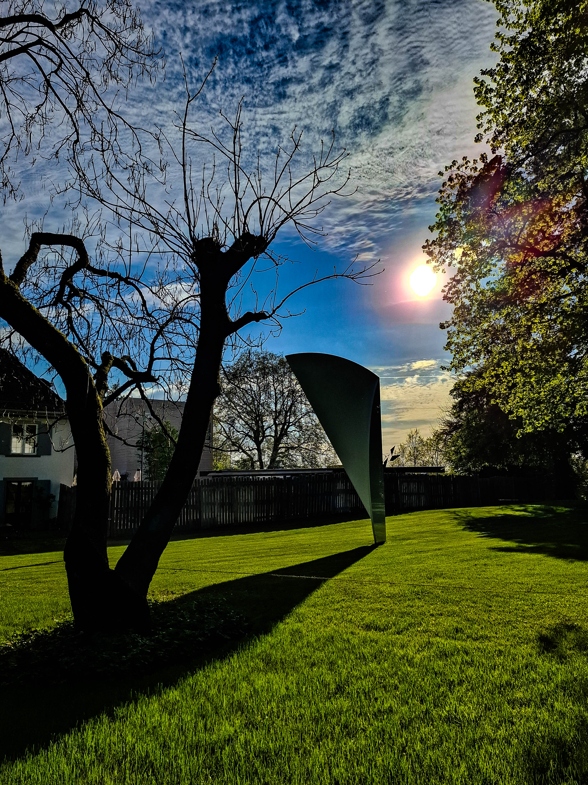

## 25.04.2026 在 Valse 失速之前 / Before the Waltz Falters
### Le Grand Récital à Lausanne: Martha Argerich & Dong Hyek Lim

---

### Program

Wolfgang Amadeus Mozart:
Sonata for Two Pianos in D major, K. 448

Franz Schubert:
Fantasia in F minor, D. 940

 

*Intermission*

 

Sergei Rachmaninoff:
Symphonic Dances, Op. 45

 

**Encore**  

Maurice Ravel:
La Valse, M. 72

---

 

「有情風萬里卷潮來，無情送潮歸......」  
— 蘇軾《八聲甘州·寄參寥子》  
 
今晚是我第一次聽 Martha 的現場，只能說神中神中神！Dong Hyek 的 Primo 也很有說服力。猶如走進了 19 世紀的沙龍般自然，音樂本該如此。從 Vienna 到 Moscow，回顧一位末代公主的巨流河。  
 
Mozart 走在 Vienna 的大街上，春華灼灼。那是法國畫家 Paul Cézanne 筆下的山村寫意，清泉潺然；又或者是 Martha 喜歡的 Schumann 的作品 Waldszenen，深林步伐的陰影間，透著深沉篤定之光。  
 
Schubert 起於闇影，起於市場小販的一次隱密交易。金流匯聚向王城衰亡的反曲點。在極其輝煌的沙之宮殿之下，有兩隻鹿哀悼，面朝東方。  
 
1913 年，在 Rachmaninoff 與 Ravel 的狂暴舞會之中，驟雨傲然而至。彼時，公主自高城望向海濱侵晨的熹光，尚未注意到悄然崩塌的沙樓地基。那時的她還不知道，她將在無數片舞池交疊的殘影中，去複拓地下室的灰燼，去追憶那些曾在樹梢晃動的明亮槍響。  
 
星球引力的傾斜罅隙間，拉普達在崩解中歸升。

 

---

 

“The wind, as if with feeling, summons the tide from afar; the tide, indifferent, recedes…”  
— Su Shi, *Ba Sheng Gan Zhou*  
 
This was my first time hearing Martha Argerich live. There is little to say except this: legend upon legend! Dong Hyek Lim, taking the Primo, was equally compelling. The evening unfolded with the ease of a nineteenth-century salon, as though music had always belonged there. From Vienna to Moscow, it traced the great flowing river of a last princess.  
 
Mozart moved through the streets of Vienna in full, blazing bloom. The sound recalled a Cézanne landscape of village light and a murmuring stream; it also carried something of Schumann’s *Waldszenen*, which Martha so loves, where a quiet, steadfast radiance lingers between the shadows of footsteps in the forest. What emerged was not merely clarity, but a form of confidence held in balance.  
 
Schubert, by contrast, began in shadow, as if from the aftersound of a hushed transaction at a street stall. Invisible currents gathered, converging toward the inflection point of a royal city’s decline. Beneath a palace of dazzling sand, two deer seemed to stand in mourning, facing east. The music did not collapse; it revealed where the structure had already begun to give way.  
 
By 1913, the ballroom had become violent. In the music of Rachmaninoff and Ravel, a storm arrived, sudden and almost defiant. From her high city, the princess looked toward the first light along the shore, unaware that the foundations beneath her had already started to erode. She did not yet know that, among the overlapping afterimages of countless dance floors, she would one day lift an imprint from the basement ashes, summoning the bright gunshots that once trembled among the treetops.  
 
Within the tilted fissures of planetary gravity, Laputa rises homeward even as it falls apart.  
 

  <figure style="flex: 1; margin: 0; text-align: center;">
    
  </figure>

