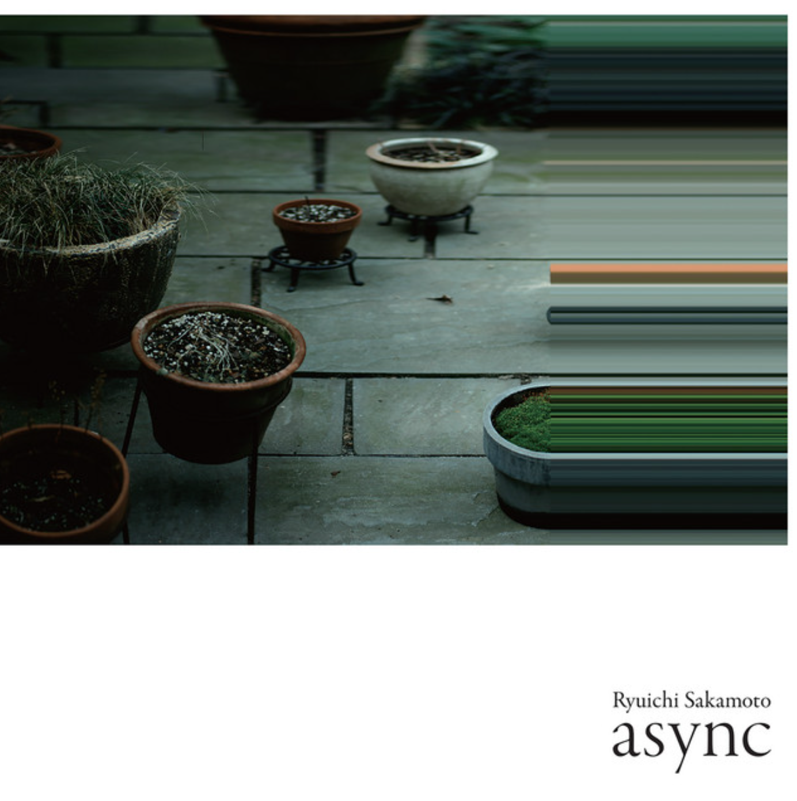

## Async

### andata
毀壞已經無法阻止  
這是最後的行進  
以及墜落。黃昏的沙丘上  
仙人掌在資料推演中磨損  
追尋莊嚴的振動  

 

### disintegration
鐘擺；囚徒  
在意識嵌合的三相點  
齒輪如賦格散落  
於高維度回歸  

 

### solari
光河汩汩流動  
紋路殘缺的法陣通往衰亡  
日晷在石板上  
測量相續，召喚即將到來的  
文明：那是最後的慈悲  

 

### zure
純粹的影子交疊於  
城牆傾圮的輓歌  
閃爍，刮擦時空的間隙  
腳步逐漸逼近……  
此處無有未知，亦無有遺忘  

 

### walker
背負著整個世界的黑暗  
在白夜裡行走  
最後一次，他向枯枝頂禮  
對準鏽蝕的轉經輪  
虔誠的鐘聲迴盪於虛空  

 

### stakra
失眠蔓延成海——  
在陌生的疆域，旅人以  
黯紅的六等星為中心  
反覆推算磁場的頻率  
意念穿越將滅的大氣層  

 

### ubi
懸宕的訊息自虛空中傳來  
石英堅持成形  
反覆拉扯斷續的光線  
記憶在高頻率的波段  
反射，漸弱，再次融入暗影  

 

### full moon
死亡或者明天？我們  
看見滿月升起，並且想像  
生命是一永不枯竭的井  
核心同時振動  
有風吹過飄搖的孤獨  

 

### async
繁星明滅。試圖預言無常  
卻見枯弦交替，不規律  
分解，往返疊加  
腳步占領異質的場域  
在海嘯之後  

 

### tri
凝結。空白的意識  
太初第一個元音  
等生，雖榮猶枯  
在逐步增強的共鳴間  
勾勒出澄明的星系  

 

### Life, Life
如何在夢中覺知  
一切等同如幻？  

 

### Honj
十三月，既望，行深於楓林間  
若說鳥居分隔神界與俗界，那麼  
何處是神性與人性的分野？  

 

### ff
光與線寂滅於  
侵晨  
空明交響  

 

### garden
回歸，回歸於一  
投影於萬千葉片  
他曾遊幻如火，亦靜定  
似水。因滅果亦滅  
於此菩提生  

 

---

 

### andata
Destruction can no longer be halted.  
This is the final procession  
and the fall. Upon the dunes at dusk  
a cactus erodes through the calculus of data,  
seeking a solemn vibration.  

 

### disintegration
Pendulum; prisoner.  
At the triple point where consciousness interlocks,  
gears scatter like a fugue  
and regress to a higher dimension.  

 

### solari
A river of light flows ceaselessly onward.  
The incomplete maṇḍala, its lines fractured, leads toward decay.  
A sundial upon the stone slab  
measures the saṃtāna, summoning the civilization  
yet to come: that is the last karuṇā.  

 

### zure
Pure shadows converge  
upon the elegy of crumbling walls.  
Flickering, scraping at the interstices of spacetime,  
footsteps drawing ever closer…  
Here there is no unknowing, nor is there forgetting.  

 

### walker
Bearing the darkness of the entire world,  
he walks through the white night.  
One last time he prostrates before the dead branch,  
facing the corroded mani wheel—  
a devout bell reverberates through the void.  

 

### stakra
Insomnia spreads into a sea—  
in an unfamiliar territory, the traveler  
takes a dim red sixth-magnitude star as center  
and calculates the frequency of the magnetic field  
again and again. Intention pierces the dying atmosphere.  

 

### ubi
A suspended message arrives from the śūnya.  
Quartz insists on taking form,  
pulling and stretching the intermittent light.  
Memory, in the high-frequency band,  
reflects, attenuates, and dissolves once more into shadow.  

 

### full moon
Death or tomorrow? We  
watch the full moon rise and imagine  
that life is a well that never runs dry.  
The core vibrates in unison;  
wind blows through a wavering solitude.  

 

### async
Stars flicker on and off. Attempting to prophesy anitya,  
one finds only withered strings alternating, irregular—  
decomposing, superposing back and forth.  
Footsteps occupy a heterogeneous field  
after the tsunami.  

 

### tri
Condensation. A blank consciousness—  
the first vowel of the origin.  
Arising in equality, though flourishing, still withered,  
amid a gradually intensifying resonance  
it traces a luminous galaxy.  

 

### Life, Life
How does one awaken within a dream  
to know that all things are equally māyā?  

 

### Honj
The thirteenth month, the night past the full moon—  
practicing prajñā deep among the maples.  
If the torii divides the sacred from the profane,  
then where lies the boundary between the divine and the human?  

 

### ff
Light and line enter nirodha  
at the break of dawn—  
a symphony of luminous emptiness.  

 

### garden
Return, return to the one.  
Projected upon myriads of leaves,  
he once roamed through māyā like fire, yet dwelt in samādhi  
like water. When the cause ceases, the effect ceases too—  
bodhi arises here.  

 
 

  <figure style="width: 80%; margin: 0; text-align: center;">
    
    <figcaption>In memory of Ryuichi Sakamoto (1952–2023). Inspired by <i>Async</i>, 2017.</figcaption>
  </figure>

